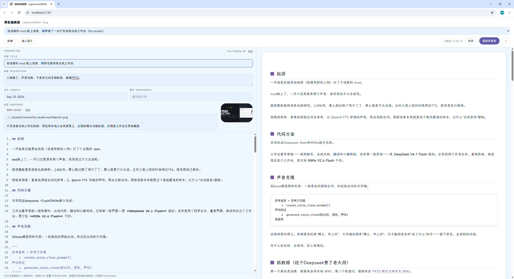
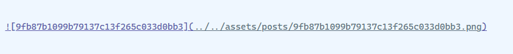
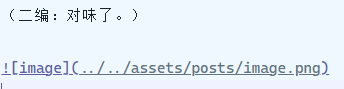

## 起因

我记得这仓库里应该有MD编辑器。

让 AI 翻了一遍：编辑器库（monaco / codemirror / easymde / md-editor / tiptap / vditor）0 命中；`blog/src/pages/` 的路由一条条列出来，没有编辑页；`packages` 里只有一个 `ProfileEditor.vue`，那是改昵称和头像的；`auth/operations` 里就一个 SQL。

确实没有。我去，可能落在我另一台设备了没移植过来，重新做一个得了。

需求也简单：左边编辑右边预览，能直接改博客里的文章，改完一键发布。另外我拖进去的图片、粘进去的标题，得自己走到该去的位置，别让我再手写那串 `../../assets/...`。

## 代码

 **DeepSeek V4.1 Flash** 

## 效果

## 我改过一次主意：预览怎么渲染

一开始我选的是**嵌真实的 Astro 页面**：编辑器把文件写盘、博客的 dev server 热重载、右边 iframe 直接看线上那篇页面的样子。所见即线上，最准。

然后大鲸鱼跟我提醒了这么搞很容易报错。

因为 Astro 对 frontmatter 是**严格**的：`title` / `description` / `pubDate` 缺一个就报错。而它要一边打字一边刷新——正打一半引号没闭合，右边就白给你看，一顿一顿的。

好家伙这样我想起了当年Chat时代我跟GPT一点点聊来写overleaf的日子，这玩意右边的预览当时就是一直报错我啥也看不到，给我干PTSD了。

那还得了，最后改成**自己渲染**：markdown-it + Shiki，主题和正文排版都对着博客抄。代价是目录、阅读进度、评论区没有（那些是文章页布局给的）；换来的是不用管 dev server，frontmatter 也不卡你。

顺带，frontmatter 干脆不让手写了，做成表单。**"标题自动填进 frontmatter"就是从这儿来的**：你只要在标题框里打字，文件那边自然就对了。

## 拖进去的图片，自己会到位置上

大Agent时代，我对文件管理有着偏执般的要求，我说不出具体的实现里面是怎么写的，但凡是AI的工作我对仓库目录，文档位置都得控制的一清二楚。这个博客的资源管理也不例外，主要也是为了更轻松一点。
- 图**拖进正文**任意处 → 存进 `assets/posts/`，光标处插入 ``
- 点**选图片当封面** → 存进 `assets/covers/`，写进 `heroImage` 和 `heroImageAlt`
- 粘一段以 `# 标题` 开头的文字 → 标题栏是空的话，自动把这一行提到 frontmatter，正文里不留残影

文件名会洗成小写连字符，重名自动加序号；中文名洗不出东西就退成 `image.png`。
上面那个图我就是直接粘贴进去的，待会看看有没有正确处理。

（二编：对味了。）

还有叠盒子。

## 为什么要做编辑器呢

不过说到底，让AI一口气把文章弄好发布不就得了吗，为什么要大费周章弄这个编辑器呢。
在这里有些话需要说清楚，为了节省时间提高效率吧，我的每一篇博客都是让干这个活的会话直接起草的，但是AI写这个推文是真的不行，写出来的文章一股味从头灌到尾，transformer就这样，逐字推出来的文章就是有着“顺理成章”的诡异感，真人写东西一般挺Jump的，反正我是想到哪写到那。哪怕把我这个要求告诉它，它也并不真的理解。

不过我不知道Astra写起文章能不能避免这一点，我舍不得用哈哈XD。

## 最后

这工具没什么技术含量，就是把我改文章那点手忙脚乱收进一个窗口。不过对于我自身的编辑体验改善了很多，UI向网站靠拢而不是用原生md，加上对资源的自动处理，写起博客来确实轻松多了：不然我只会向AI许愿。