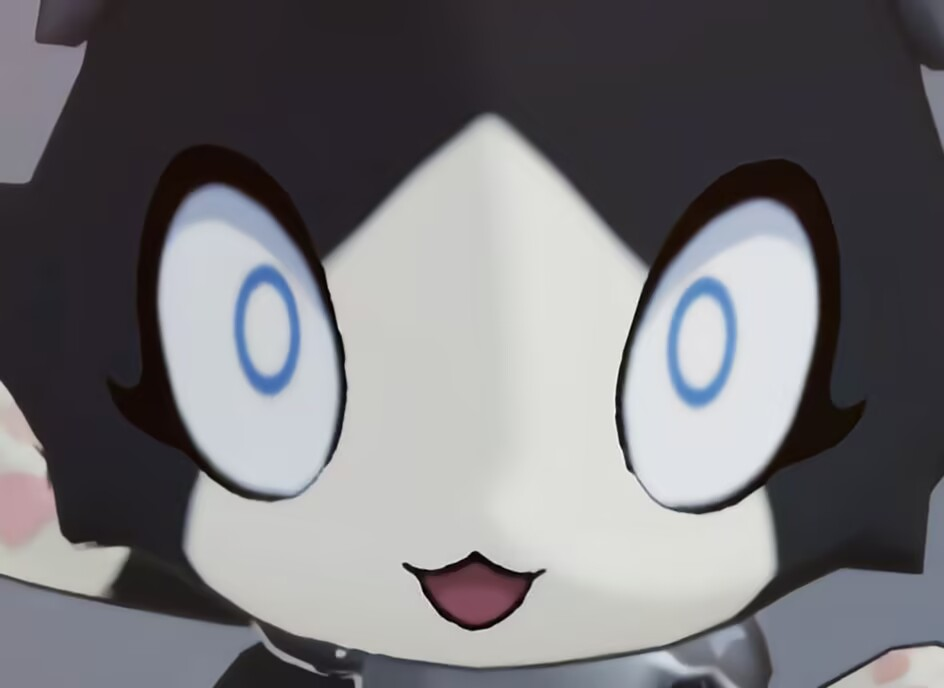
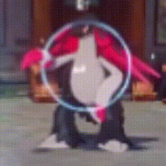

## 起因

页脚之前太单薄了，就想着加点二次元的东西进去。这时冒出一个念头：找一张 25 时五个馒头人的合照不就行了？结果网上翻了两天，都没找到现成的。

找不到那就自己做。正好 MySekai 的 Q 版模型（粉丝圈叫馒头人）有公开的 PMX，把五个人在 MMD 里摆成一排出一张图就行。

问题是我没用过 MMD，软件都是那晚才装的。

## 下载

模型是 fuyuchan39 做的 PMX，从 DeviantArt 下的。Readme 里写了条件：不能商用，不能二次配布，可以编辑使用。我渲染成图放在非商业的个人网站上，在允许范围内。

MMD 我下的是 9.32 的 64 位版。装好打开，把五个模型挨个加载进去，默认 A 字型站成一排。到这一步挺顺利的，我以为今晚能早点弄完。

## 调姿势

麻烦的在姿势上。社区有很多人免费分享姿势文件（VPD 格式），DeviantArt 上搜 pose pack DL 能找到一大堆，我下了好几包。导入之后才发现问题：这些姿势基本都是给标准比例模型做的，馒头人的建模比例很特别，直接套上去会扭曲得很厉害，胳膊的角度不对，腿也会穿模。

所以每个姿势导入后都得手动微调。选中关节，转动角度，看一眼效果，不对就再转一点，肩、肘、腰、腿一个个过。五个人每人一套姿势，就这么慢慢抠。中间好几次觉得差不多得了，又觉得这图要一直挂在网站上，还是回去继续调。前后花了一个多小时，调完最后一个的时候已经快十二点了。

## 导出

姿势都调好后，关掉地面网格线，调整视角让五个人都在画面里，然后直接从 MMD 导出了 PNG，1920×640，不到 500KB。这个尺寸放在网页上完全够用，加载也不慢。

看到成品的那一刻还是挺激动的。折腾了一晚上，最后这张图就是我想要的样子。

## 谢谢

最后谢谢这些作者。fuyuchan39 的模型，MitzimMD、Aisukawaii222、xinshin、Budo Masuta 的姿势包，全部免费分享。没有他们做的这些东西，我这个页脚根本做不出来。

