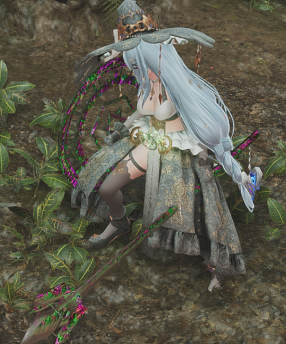
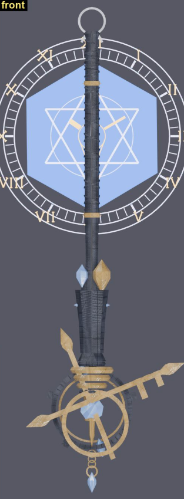

## 起因

做的是《怪物猎人 荒野》的外观替换：给盾斧换成一把日式魔女法杖。

这个灵感有多方面的来源，一是我玩MHRS的时候是打的惠惠mod，有配套的魔法杖替换掉盾斧；结果这个理科魔女Mod质量挺高的，但是荒野就没人用什么法张造型做盾斧了，我就想吧既然AI建模现在这么厉害，那就自己动手呗。至于把法阵剑盾形态平时收着，举盾防御的时候才浮现，这个不难想到，我觉得形态切换早就有人做了，我想应该是能够实现的。

## 代码方面
v1.0  **DeepSeek V4.1 Flash**

v1.1  **Astra High**

## 刚开始翻了好多车

第一版是一根纯淡紫色的法杖。配色是从 11 个版本里挑出来的，中间把游戏搞黑屏了三次。花了大量时间找原因，一开始还被狩枝盒子的打包方式误导了，最后决定不用这个玩意了由Agent自己管理mod。

**贴图必须打进 pak。** 散着放在 `natives/` 里游戏不认，直接黑屏。这个是真的上了大当，fluffy mod manager和狩枝对mod的处理方式不一样，一开始用狩枝的方式打包一直把游戏搞坏，浪费了好多时间验证游戏完整性。

**`MetalParam` 必须改成 0。** 默认 1.0 会把整把武器染成青绿色，跟金属一点关系没有。第一次进游戏手上拿了个生紫绣的青铜器（后续出问题还搞了一个出土黄铜文物版本）。belike:

还有两条硬约束从头到尾没变过：part 0 只有一个材质槽；骨架必须用原版那 7 根，新增骨骼会让几何直接消失。本来是想给法杖做环绕组件的，这个之后再看看Astra会不会有什么新见解吧。

实际上一路上遇到的bug远远都不止这些，后续也不再赘述了，Deepseek的能力还是有点有限，后期让Astra接手是真的不一样，不过也可能是Deepseek把坑都踩过一遍的原因。

## 开始堆形状

第二版就是塑形了。一开始接了点免费的3D生成，效果不怎么样，给我生成了个鱼雷出来？然后让deepseek
自己画了 5 款形状，又照着翻的资料补了 3 款"缺的形制"。不过这些造型我觉得都不太满意。

## 第 9 款：一把钥匙

第三版加的第 9 款叫 `key`，也就是现在这个杖头。

灵感是从明日方舟莫斯提马那把法杖来的。源文件名看着像"钥匙"，其实本体是双环交叉穿杆——钥匙感全在剪影上：一个环、一根十字杆、杆上带齿。

配色也是这一版加满的。

法阵在这一版换成自己画的时钟：罗马数字环、60 格刻度、六芒星、指针停在 10:10，中心一个钥匙孔跟杖头的金杆共轴。

## 低模？

进游戏一看，感觉还是低模。

我以为是面数不够，其实不是。我们那个 mesh 1,833,408 字节，原版才 183,008 字节，面数早就够了——**75% 的面来自 1.2 毫米的无差别倒角**，糊得到处都是，看着就"低模"。

后来把原版细节层关掉（不关的话，岩石贴图会混到钢杖身上），杖身改成三段式。

还有一个"拉丝"的毛病，查了很久：接缝的顶点正好落在 x=0.0，96 个面同时跨了两个骨骼组，面积 0.060 平方米。

## 法阵

法阵平面本身是一层正六边形的薄膜，半径 0.42，厚 0.8 毫米，蔚蓝色。

第一版取的 (12,40,104)，只能比线描暗。因为 part 1 的所有分区共用一个 `Emissive_Power=4.0`，单独给膜提亮做不到。

提亮的时候有个陷阱：**"平均亮度"会骗人。** 我把膜整体提亮，数字好看了，结果最高档一开，六芒星全糊成一片。后来改成膜用 (38,92,196)、线加 `LINE_GAIN=1.4`、power 提到 5，均亮从 126.6 到 189.1，星纹还在。

## 防御才出现的法阵，管理器做不了
常态的时候法阵也黏在手上不是很奇怪吗？

"举盾防御的时候才出现法阵"这个需求，我本来打算用 ArmorVariantManager 做。查完发现它根本没有 guard 这个概念，做不到。

那就自己写 Lua。

采了防御动作的 motion ID：{200, 201, 202}，一共 10793 帧、242 秒。这个可是我带着脚本进游戏亲自测试的。

修好以后又遇到"防御的时候一移动，法阵就没了"。以为是逻辑写反了，实际是它**每秒闪一次**——防御循环里状态一直在抖。加了个 2.0 秒的余辉压掉。

## v1.0

到这儿算是能用了，冻结成 v1.0，建了仓。125 个文件，1.7 MB。

对外的下载包是另一个做法：把网格和贴图合成**一个** pak 丢进 `pak_mods`。这样就不受"贴图必须放 sub 块"那条约束了——那条只在 patch pak 的语境下成立。1.5 MB，拖进 Fluffy 就能用。

## v1.1

v1.0 之后我觉得模型还能再提一提，就用 Tripo3D 把网格送去重拓扑，顺便生成了一套新贴图，收回来再拼进去。

结果 DeepSeek 驾驭不住了。头重脚轻、固定握把那里握空、杆身看起来是弯的，实机渲染效果也不太好，像出土文物，改了很多次都不对。再给牢鲸提建议也只能原地打转转。

于是我把项目从头到尾盘点了一遍，写成一份简报：这个项目在做什么、哪些约束不能碰、现在有哪几个版本、哪些判断已经过期。然后把简报连同实机截图交给 **Astra**。

好家伙，我只能说**Astra**大人是真的牛。

三轮之后：杖身恢复连续，杖头回到原始设计做保形精修，材质按金属 / 深蓝 / 宝石分区，法阵换成平坦法线、单独控发光，最后把渲染也优化了。

这样就不像之前看不清楚还灰头土脸的了。

## 一些限制

- 发布包不分发「理科魔女」那套皮肤，也不依赖它，截图里是作者 Fruit milk 的 mod
- v1.1 的模型预览和实机图都在作品页，下载在 GitHub
- 贴图这一轮从 1K/2K 升到 4K，pak 从 2.94 MB 涨到 11.7 MB
- 和 Capcom 没关联，pak 是游戏资源的修改产物，请在自己有游戏的机器上用

## 最后

这一路最花时间的其实不是建模，是"以为是 A，结果是 B"。黑屏是因为贴图散装，低模是因为倒角，金件发灰是因为贴图底色，杖头飞出去是因为权重。症状和根因每次都不在同一个地方，Deepseek每次都只能猜，我也跟着一遍一遍的重试。

要是我有用不完的Astra就好了。

下一步想试法阵的透明和流动感。成不成得看游戏着色器认不认。目前这个法阵还是有点像实体。
