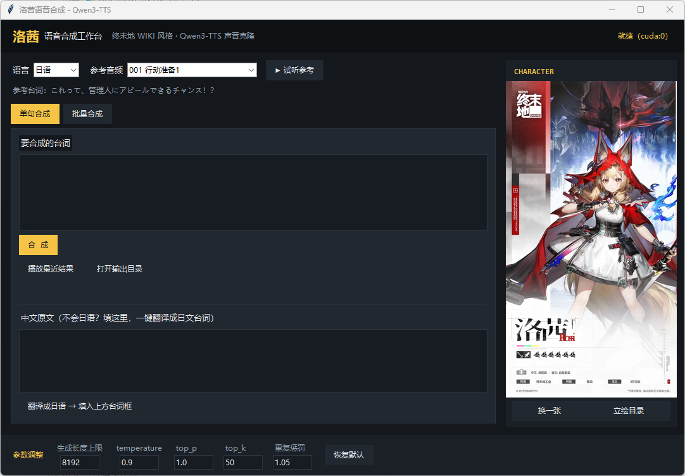
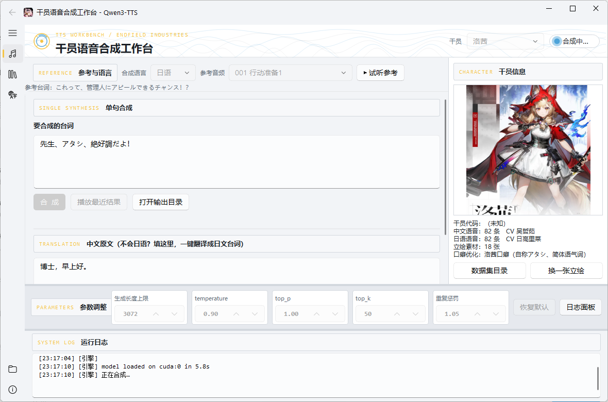
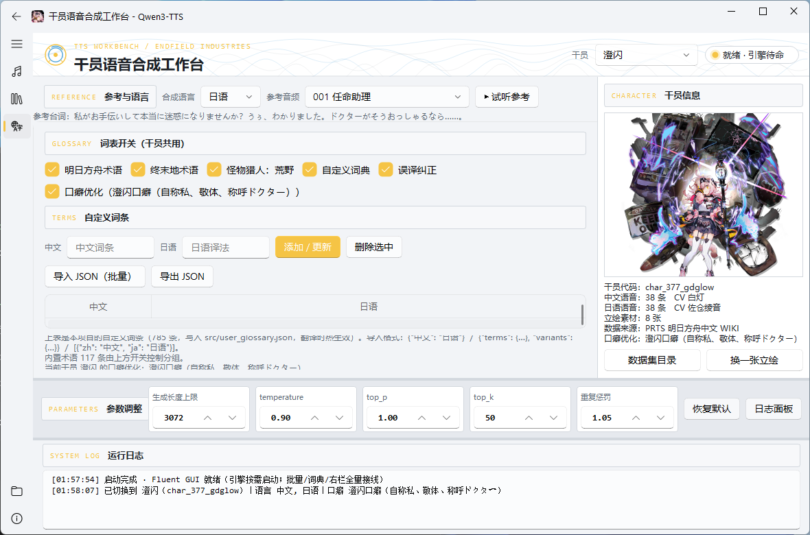

## 起因

一开始其实就是给纳塔（怪猎荒野的人物）打了个洛茜的 mod。

mod换上了，一开口还是原来那个声音，我寻思这不大合适吧。

就想着配套把语音也换掉吧。上B站找，要么就过期了用不了了，要么就是不太合适。正好之前上班的时候用过TTS，就寻思自己做咯。

思路很简单：拿角色原版台词当参考，让 Qwen3-TTS 学她的声线，再去念新台词。原版语音本来就是这个角色最准的样本，比什么"合成音色"都贴。

## 代码方面

本项目由Deepseek flash和MiMo接力完成。

工作台最早那版——抓取脚本、合成内核、翻译和口癖规则、还有第一版界面——是 **DeepSeek V4.1 Flash** 搭的。后来把两个目录合并、重做界面、换成现在这个工作台，是交给 **MiMo V2.6 Flash** 干的。

## 声音克隆

给base模型两样东西：一段角色的原版台词，和这段台词的文字稿。

```
参考音频 + 参考文字稿
    ↓  create_voice_clone_prompt()
声线特征
    ↓  generate_voice_clone(新台词, 语言, 声线)
新音频
```

这两样得对得上。音频里念的是"博士，早上好"，文字稿也得是"博士，早上好"，它才能把音色和"说了什么"拆开——留下音色，去读别的内容。

对不上会怎样，后面讲，这上面栽过。

## 抓数据（这个Deepseek费了老大劲）

第一个角色是洛茜，数据来自终末地 WIKI；第二个是澄闪，数据来自 [PRTS 明日方舟中文 WIKI](https://prts.wiki)。

抓取脚本 `scrape_prts_voice.py` 只用 Python 标准库，不装 requests 也能跑，对任意干员通用。

名字听着像是"把页面上的音频下载下来"。实际上一路都在解谜。

**页面上根本没有音频直链。**

PRTS 的语音表是前端组件渲染的，源码里只有数据属性：

```html
<div id="voice-data-root"
     data-voice-key="char_377_gdglow"
     data-voice-base="日语:voice/char_377_gdglow,中文-普通话:voice_cn/char_377_gdglow,…">
```

真正的地址是前端 JS 拼出来的 `torappu.prts.wiki/assets/audio/{voiceBase}/{文件名}.wav`。

这里有两个小坑。文件名**必须转小写**——`CN_001.wav` 的实际资源叫 `cn_001.wav`，照着 HTML 里的大小写拼，就是 404。另一个是 `voiceBase` 里已经带了干员代码，别再拼一次。

**WAF 会把默认请求头挡掉。**

Python `urllib` 默认发 `Connection: close`，PRTS 直接给 403。补上 `Accept`、`Accept-Language`、`Connection: keep-alive` 才拿得到页面。

**立绘比语音还藏。**

干员页里内联的 `charimg_params`，`url` 字段是空的，真地址是 charinfo 那个应用运行时算出来的。哈希没去逆，而是顺着 `getPath(...)` 的调用点把命名规则读出来，再问 MediaWiki 的 `imageinfo` API 要地址，顺便把宽高也拿回来。

然后在这里栽了个跟头。**MediaWiki 会把标题里的下划线规范化成空格**：问它"立绘\_澄闪\_1.png"，它回来的是"立绘 澄闪 1.png"。键名不换回来，一个都匹配不上。

更阴的是时装名只写在干员主页上，`/语音记录` 子页里没有。最早是拿子页去解析的，时装候选全空——而代码里是"静默 `continue`"跳过的，什么也不报，问题就这么被藏住了。现在它会打印「PRTS 上存在 N/M 个候选」和缺了哪几个。

抓完的成果：

| 干员 | 来源 | 中文 | 日语 | 立绘 |
|---|---|---|---|---|
| 洛茜 | 终末地 WIKI | 82 条 | 82 条 | 18 张 |
| 澄闪 | PRTS 明日方舟 WIKI | 38 条 | 38 条 | 8 张 |

顺带一提，澄闪连"精英1"立绘和差分都没有，PRTS 上就没这张图，谁也没办法。最后是 6 张媒体库的图加 2 张半身像。

立绘 PNG 一共 18MB，加 `--art-webp` 转存后 4.1MB，缩到四分之一，尺寸没变。

## 参考音频不能太长

这条是试出来的（准确的说我在上班的时候调试base模型就发现了这个问题）

Qwen3-TTS-Base 的参考音频一长，会**克隆卡死**。官方建议 3 秒左右。可干员的台词经常十几秒。

所以得切。`ref_split.py` 按标点找句子边界，对上音频里的静音中点，只保留切点之前的完整句子。澄闪第 001 条中文 8.1 秒、日语 11.5 秒，日语那条会被切成第一句，大概 5.3 秒。洛茜的 001 才 3.7 秒，不用切。

**音频和文字稿必须同时截断。**

只截音频不截文字稿，就等于让模型去复述它根本没听到的内容。要是第一句本身就超长——比如「生日」那条 28.7 秒——就按时间比例两边一起截。纯标点碎片（「……」「。」）得并回前一句，不然按比例估算的边界会被带偏。

## 日语不会写啊


中文台词好办，日语才是主战场。毕竟我怪猎用的是日语配音（一般也不会想用中配吧？）
TTS是本地的，我就不想接翻译API了，于是索性进一步给合成台内置了翻译模型
本地跑 NLLB-200-distilled-600M，管线长这样：

```
官方台词直查（和官方日文一模一样就零机翻）
  → 术语前替换（中文词先换成官方日文写法）
  → NLLB 分句翻译（长句切短）
  → 误译纠正（variants）
  → 全角标点清理
  → 干员口癖优化
```

一一说。

**必须分句翻。** 长句整段塞进 NLLB 会丢词丢句。得按 `。！？，；、…` 切短再翻，每 8 句一批——38 行台词能切出上百个短句，一次全塞进去会把 12G 显存撑爆。

**NLLB 会复读。** 长口语句上会退化成「ほら ほら ほら…」「田舎の田舎の…」这种。拿最长的 12 条台词实测：不加 `no_repeat_ngram_size`，退化 3/12；设成 5 之后 0/12，输出长度比从 1.21 降到 0.97，速度还快了 3 倍。

**纯标点不能进模型。** 单独一个「……」送进去，它会凭空编出「私は..。」再拼回句子里。现在无汉字/假名/字母数字的片段直接原样留着。

### 口癖不能共用

之后我让AI也是对角色口癖做了优化。

| | 洛茜 | 澄闪 |
|---|---|---|
| 自称 | アタシ 38 次 / 私 1 次 | 私 16 次 / アタシ·僕 0 次 |
| 语气 | 常体（だよ／ないよ） | 敬体 です・ます 40 次，句尾常体 0 次 |
| 称玩家 | —（叫管理人） | ドクター 15 次，从不出现 あなた／君 |
| 特征 | あの／えっと／その 15 次 | 「〜んです」13 次 |

拿澄闪 38 条官方台词做对照，官方日文当基准：

| | あたし／アタシ | あなた／君 | ドクター | 句尾常体 | です／ます |
|---|---|---|---|---|---|
| 官方日文（基准） | 0 | 0 | 15 | 0 | 40 |
| 纯机翻 | 0 | **6** | 9 | **3** | 22 |
| 词典 + 澄闪口癖 | **0** | **0** | 16 | **0** | 30 |

机翻本来会冒出 6 次「あなた／君」、3 处句尾常体，套上 profile 后归零，称呼和敬体都贴近官方。这组数是改规则时的回归依据，动一次 `_stylize_chengshan` 就得重跑一遍。

术语表是另一层。明日方舟组的 41 条是对着澄闪官方日文台词一条条核过的：源石技艺→アーツ、法杖→アーツユニット、电荷→電気。歧义太大的**故意不收**，比如 アース→アーツ（"接地"在日语里就是 アース）、医者→ドクター，怕误替换反而伤了正常译文。

词表所有干员共用一份，内置明日方舟 41 / 终末地 7 / 怪猎荒野 69 条，加自定义的 785 条。改完不用重启，翻译时热生效。（怪猎那 69 条跟明日方舟没什么关系，先放着。）

不过肯定也不是一定很准：NLLB-600M 对长口语还是会出错译，**译文当草稿手改再合成**。只有和官方台词完全一致的句子才会零机翻直接命中。

## 把界面和模型拆开

第一版界面长这样：我觉得不大好看。



能用，但史山问题也挺大：模型加载、合成、翻译全在界面进程里跑，引擎一崩界面跟着崩；界面里一套合成循环，命令行里又一套，命名已经开始漂移；窗口大小、干员、语言、参数，每次启动全重置。

于是我要求：**用 PySide6 + QFluentWidgets 重做，侧导航加常驻右栏，底部参数条留着，关窗要记住上次状态。**

从这里开始把工作移交给了MiMo。
重写的核心是把重活赶出去，做成两个进程：

```
启动 bat / 快捷方式
  └─ 全局 Python: gui_fluent.py      ← GUI 进程（PySide6，零重依赖）
        │ stdin  → JSON 行命令
        ├────────► .venv\python engine_worker.py   ← 引擎进程（独占 torch / NLLB）
        │ stdout ← JSON 行事件
        ◄────────
        │ stderr ← 第三方日志 → GUI 日志面板
```

界面进程不 import torch 就不加载，起得快，也崩不了。引擎按需启动（第一条合成或翻译命令才拉起来），空闲 600 秒自己退出，崩了下次命令自动重拉。合成内核抽成 `engine.py`，worker 和命令行共用一份。

中间有个隐蔽但要命的问题：**worker 的 stdout 是协议通道，不能被第三方库的 print 污染。** qwen_tts 和 transformers 的 import 警告、进度条全往 stdout 写，混进去一行协议就解析错了。

解法是在 worker 入口前几行把 fd 换掉：

```python
import os, sys
_proto = os.fdopen(os.dup(1), "w", encoding="utf-8", newline="\n")  # 协议独占 fd1 的副本
sys.stdout = sys.stderr                                             # 之后所有 print 改道 stderr
```

协议走 fd1 的副本，其它输出全落 fd2，由界面读线程收进日志面板。

界面风格也是我指定的，走**终末地工业**：石墨蓝深底、琥珀 `#f5c445` 当亮色、分区标题做成设备铭牌、状态栏做成指示灯，顶栏垫一层低透明度等高线。

## 现在的样子

左边导航三个工作页，顶栏切干员，右侧常驻立绘和信息，底下是参数条和日志。





批量模式每行一句，行首可以写参考标记：`12` 是当前数据集第 12 条，`jp:12` 指定语言，`洛茜:jp:12` 还能跨干员借音色。逐行兜错，某行标错了只记进 manifest 跳过，不影响别的行。

## 一些限制

- PRTS 只列**游戏里有音频的**语音。澄闪抓到 38 条，因为游戏内序号 1~44 本身就跳号
- 日语第 37 条「生日」在 PRTS 上是漏翻的（日文栏直接填了中文），数据集里标了 ⚠，**不能当参考音频**
- 半身像是游戏内小尺寸图（180×360），放大看会糊，要高清得用「立绘\_」开头的那批
- `flash-attn` 没装，走 PyTorch 手动注意力，加载时的警告可以忽略
- 中→日翻译只对日语合成有意义，目标语言选中文时翻译按钮直接禁用
- 原版语音版权归鹰角网络所有，本项目仅用于个人研究

## 最后


也许以后会加新的角色？看到时候有什么需求吧。